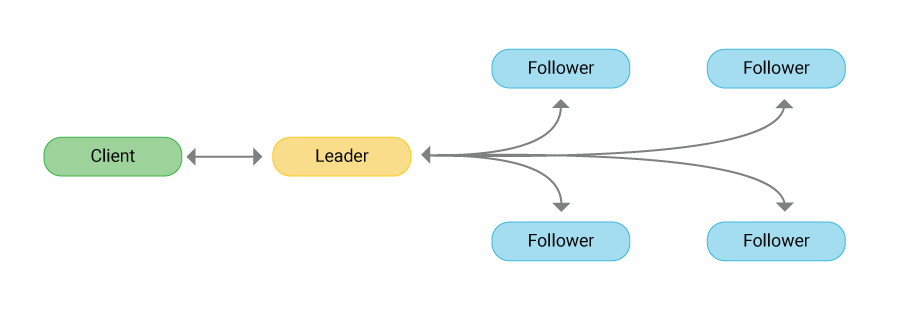
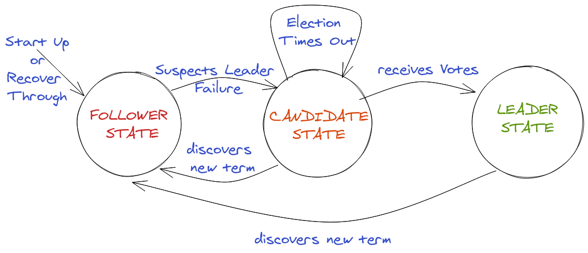
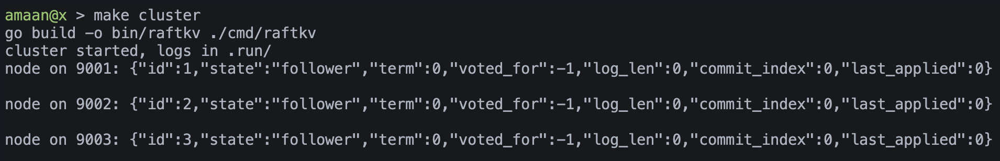
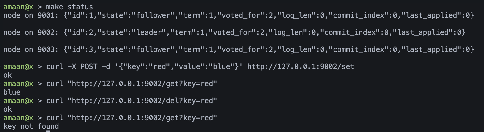
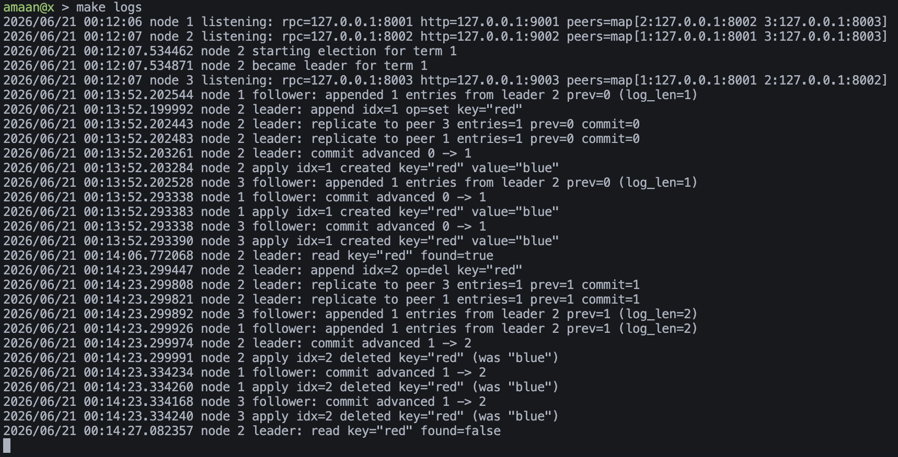
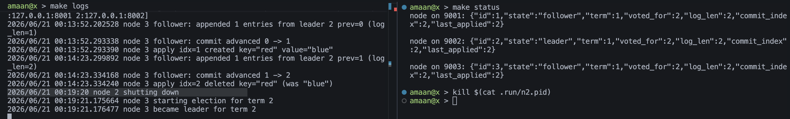

# Raft Consensus Implementation

## 1. Introduction

Distributed systems need a way to agree on the order of events. When several machines try to update the same data, they have to settle on one version of history. If they disagree, users see different answers depending on which server they talk to. Raft is a consensus protocol that solves this problem by electing a single leader to serialize all writes and replicating those writes to a quorum before they take effect.

This project is a working Raft cluster written in Go, with a small key value store sitting on top of the log. Three nodes talk to each other, elect a leader, replicate writes, and stay consistent through process failures. The goal was to understand Raft by building it, not to ship a production database.

## 2. What Raft Is

Raft is a protocol with which a cluster of nodes can maintain a replicated state machine. The state machine is kept in sync through the use of a replicated log. For more details on Raft, see "In Search of an Understandable Consensus Algorithm" (https:/raft.github.io/raft.pdf) by Diego Ongaro and John Ousterhout.

A Raft cluster has one leader at any time. The client always talks to the leader, and the leader fans every write out to the followers before it acknowledges the client.

The protocol breaks consensus into three pieces.

1. Leader election. One node is chosen as leader for a term. Followers wait to hear from the leader. If the heartbeat stops, a follower becomes a candidate and asks the cluster for votes. A candidate that wins a majority becomes the new leader.
2. Log replication. Clients send commands only to the leader. The leader appends each command to its log, sends the entry to every follower, and waits until a majority has stored it. Once a majority has the entry, the leader marks it committed and applies it to the state machine.
3. Safety. Raft makes sure that once an entry is committed, it survives leader changes. A node can only win an election if its log is at least as up to date as the majority. This prevents a stale node from being elected and rolling back committed data.

Every node lives in one of three states. A follower that stops hearing from the leader times out, becomes a candidate, and asks for votes. The diagram below shows the transitions between follower, candidate, and leader.

## 3. Why Raft

Paxos was the standard consensus protocol for years, but it was famously hard to follow. Raft was designed for understandability without giving up correctness. It splits the problem into clear pieces, uses strong leadership to simplify the common case, and uses randomised timeouts to keep election conflicts rare. Engineers can read the Raft paper, build a working node, and reason about edge cases. That is the main reason it has spread so widely across modern databases and infrastructure systems.

Raft also fits the shape of real systems. Most workloads have a single writer pattern. Replicating through a leader is fast in the common case and only pays the election cost when a node fails. Strong leadership also makes client behaviour simple, since the client only needs to find the current leader and send writes there.

## 4. Systems Using Raft

Raft is the backbone of many distributed systems used in production.

Message Brokers and Streaming

1. Apache Kafka. Replaced legacy reliance on ZooKeeper with a modified, quorum based Raft mechanism called KRaft for internal metadata management.
2. RabbitMQ. Uses Raft plugins to implement durable, strongly replicated FIFO queues.

Distributed Databases

1. etcd. The core configuration and key value store for Kubernetes, entirely powered by Raft.
2. CockroachDB. Employs Raft across its replication layer for safe, multi region distributed consensus.
3. MongoDB. Utilizes a modified variant of the Raft protocol to drive its replica sets and election processes.
4. YugabyteDB. Integrates Raft inside its DocDB replication layer for strong, synchronous consistency.
5. Neo4j. Uses Raft to ensure safety and continuity in graph database clusters.
6. ScyllaDB. Adopted Raft under Project Circe to safely manage metadata such as schema and topology changes.

If you are running Kubernetes, you are running Raft. If you are using CockroachDB or YugabyteDB, every write goes through Raft. The same is true for the metadata path in modern Kafka. Understanding Raft is now table stakes for anyone working with distributed data systems.

## 5. What We Built

The implementation lives in three small Go packages.

1. `raft/` holds the node, the log, and the RPC plumbing. This is where leader election, heartbeats, and log replication live.
2. `kv/` is the state machine. It is a simple map guarded by a mutex. Only committed log entries are applied here.
3. `cmd/raftkv/` is the runnable binary. It parses flags, starts a node, and exposes an HTTP API for clients.

Each node speaks two protocols. It talks RPC to its peers for AppendEntries and RequestVote calls, and it serves HTTP to clients for set, get, del, and status. Writes flow from a client to the leader over HTTP, into the leader's log, out to the followers over RPC, back to the leader once a majority has acknowledged, and finally into the key value store on every node. Reads only succeed on the current leader, which keeps stale results rare.

In scope for this project

1. Leader election with randomised timeouts and term tracking.
2. Log replication with AppendEntries, prevLogIndex matching, and majority commit.
3. Safety rules so that committed entries survive leader changes.
4. A working state machine sitting on top of the committed log.

Out of scope

1. Disk persistence. The log lives in memory and is lost on restart.
2. Snapshots and log compaction.
3. Dynamic membership changes.
4. Pre vote optimisation.
5. Client redirection. Clients have to find the leader themselves.

## 6. Running the Cluster

The walkthrough below covers the four moments that show Raft is actually working. A booted cluster, a write that lands on a majority, the replication trail in the merged logs, and a forced leader failure with the election that follows.

### 6.1 Boot a Three Node Cluster

Run `make cluster` to compile the binary and start three nodes on loopback ports 8001, 8002, and 8003 for RPC and 9001, 9002, and 9003 for HTTP. The command prints the status of each node once they settle.

### 6.2 Write Data Through the Leader

Once a leader is elected, send writes to its HTTP port. The leader appends the entry to its log, replicates it to the two followers, waits for a majority, then returns to the client.

### 6.3 Watch the Replication in the Logs

`make logs` tails all three node log files at once. Every write shows up across the cluster as an AppendEntries entry on the leader, an ack from each follower, a commit on the leader, and finally an apply on every node. The screenshot below shows the merged stream while the two keys from the previous step are being replicated.

### 6.4 Kill the Leader and Watch the Election

Find the leader from `make status`, then kill its process id from `.run/n1.pid` (or n2, n3). The two remaining followers stop hearing heartbeats. After their randomised election timeout fires, one of them becomes a candidate, wins a majority vote, and takes over the term. The previously committed data is still there because a majority always had it. The merged log stream captures the full sequence, the heartbeats stopping, the timeout firing, the vote requests, and the new leader announcing itself.

## 7. Implementation Notes

A few decisions are worth calling out.

The timing constants in `raft/raft.go` are deliberately slow. Heartbeats are 100 milliseconds and election timeouts are between 400 and 800 milliseconds. This makes the log readable when you watch a real election happen. Production systems use much tighter timings.

The log uses a dummy entry at index zero. This makes the prevLogIndex calculation work for the very first real entry without a special case. The same trick is in the etcd code base.

Writes block until the entry is applied. The HTTP handler in `cmd/raftkv/main.go` calls `node.Submit` to append to the leader's log, then `node.WaitApply` to wait until the apply loop has run that entry on the local state machine. The client only sees `ok` once the write is durable on a majority and visible to a local read. If a new leader takes over before the entry commits, the client gets a timeout.

Reads also check leadership. The `/get` handler refuses to answer if the node is not the leader. This is the simplest way to keep stale reads out of the demo. A real system would either route reads to the leader or use read leases.

## 8. What This Project Showed Us

Building Raft from the paper is a different exercise from reading about it. The protocol description is short, but the implementation has many small invariants that have to hold at the same time. The hardest parts were getting the prevLogIndex matching right during replication and making sure a stepped down leader stops trying to commit entries from its old term.

Once the cluster works, it is genuinely impressive. You can kill any node at any time, in any order, and as long as a majority stays up, the data is safe and writes keep flowing through a freshly elected leader. The same property is what makes etcd safe enough to run every Kubernetes control plane in the world.

## 9. References

1. Diego Ongaro and John Ousterhout. In Search of an Understandable Consensus Algorithm. <https://raft.github.io/raft.pdf>
2. Raft project site. <https://raft.github.io>
3. etcd Raft library source. <https://github.com/etcd-io/raft>
4. CockroachDB blog on Raft usage. <https://www.cockroachlabs.com/blog/raft-is-so-fetch>
